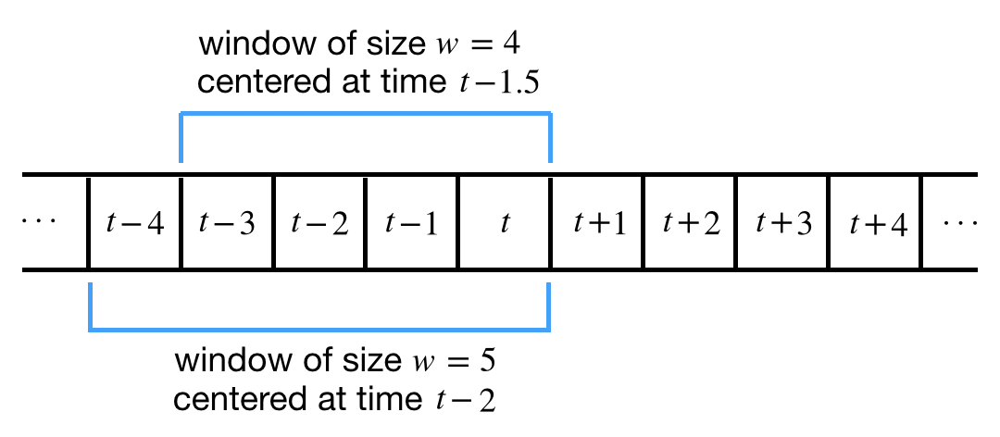
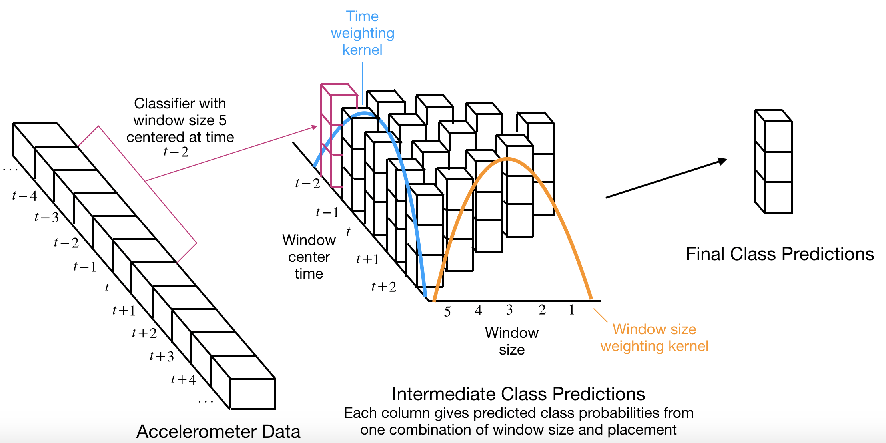

# Introduction

We're interested in generating predictions for classifications of activity type or energy expenditure for each second in time series data.  Here we explore approaches to doing this by combining predictions from classifiers that generate predictions from overlapping windows of varying lengths.

# Models

## Notation

We record accelerometer data $x_t$ at times $t = 1, \ldots, T$.  For example, $t$ may correspond to a 1-second interval, and $x_t$ is a vector of acceleration measurements at that time (e.g., at 100 Hz and 3 axes, $x_t$ may be a vector of length 300).  The response variable $y_t$ is categorical, with $C$ possible classes; our goal is to obtain a probability distribution over these classes at each time.

We have at our disposal a collection of classifiers that take as input the observed values in a specified window of width $w$ centered at time $t + o$, and generate predicted class probabilities $\widehat{p}^{w,o}_t = (\widehat{p}^{w,o}_{t,1}, \ldots, \widehat{p}^{w,o}_{t,C})$.  At each time point $t$, we have $0 \leq \widehat{p}^{w,o}_{t,c} \leq 1 \, \forall c = 1, \ldots, C$ and $\sum_{c=1}^C \widehat{p}^{w,o}_{t,c} = 1$.  We assume that the classifier generates predictions only for the time points within the window of times it sees as inputs.  As a result, if the window size $w$ is odd, the possible values of the offset $o$ are the integers from $-\frac{w-1}{2}$ to $\frac{w-1}{2}$.  For example, if the window size is $w=5$, the windows centered at times $t-2$, $t-1$, $t$, $t+1$, $t+2$ (corresponding to offsets $o = -2, \ldots, 2$) yield predicted class probabilities for time $t$.  If the window size $w$ is even, we say that the window is "centered" at a half-integer time and the offsets are also half-integers.  For example, if $w = 4$ the possible offsets are $-1.5$, $-0.5$, $0.5$, $1.5$; the window "centered" at time $t - 1.5$ contains observations at times $t-3$, $t-2$, $t-1$, $t$ (see figure).

One view of our task is that we are building a feature-weighted stacked ensemble of component classifiers defined by the different combinations of offset $o$ and window size $w$.  Specifically, we will obtain our final estimated class probabilities as some suitable combination of the estimated probabilities from these component classifiers:

$$\widehat{p}_t = f(\{\widehat{p}^{w,o}_t\})$$

In the below, we propose a series of increasingly complex formulations for the combination function $f$.  In the simplest formulation, the combined prediction is a weighted combination of the component predictions, with weighs that depend on $w$ and $o$. In more general formulations, the weights may additionally depend on observed data near time $t$, or we may abandon the weighted average scheme altogether.

## Idea 1: Kernel Weighting

The main idea of this approach is to use two kernel weightings to combine predictive distributions from classifications obtained using overlapping windows of different sizes, as illustrated in the Figure below:

For a fixed window size $w$, denote a kernel applying to the time offset by $k^{O,w}_{1}, \ldots, k^{O,w}_w$; similarly, denote the kernel applying to the window size by $k^W_{1}, \ldots, k^W_W$.  In the notation, the superscripts simply track which kernel we are considering, and the subscripts index entries of the kernel.  We require that the entries in each kernel are non-negative and sum to 1.  Our final prediction is obtained as

$$\widehat{p}_t = \sum_{w = 1}^W k^W_w \sum_{i}^w k^{O,w}_{i} \widehat{p}^{w,o}_t$$

Essentially, this is just a weighted average of the class probabilities from each component model, where the average is first calculated across the time offset axis for each fixed window size, and then across the window size axis.  In a certain sense the kernel formalism is completely unnecessary, but I'm imagining translating the offset kernel through time to obtain a classification at each time point.

In the following, we describe our approach to formulating the kernels in three stages:

1. Fixed kernel weighting for offsets
2. Fixed kernel weighting for window sizes
3. Covariate-dependent kernel weighting

### 1. Fixed kernel weighting for offsets

Formally, the above entails a separate kernel weighting along the offset axis for each window size $w$. We could treat all of the parameters $k^{O,w}_i, \, i = 1, \ldots, w, \, w = 1, \ldots, W$ as separate parameters to estimate subject only to the required non-negativity and sum-to-one constraints outlined above.

Alternatively, to reduce the number of parameters to estimate, we could use a more parsimonious parameterization of the kernels that enforces the intuition that these weights should be highest at an offset of 0 and symmetric (i.e., we could reasonably enforce that the weight given to a prediction obtained from a window centered at time $t-o$ is the same as the weight given to a prediction obtained from a window centered at time $t+o$). The first thing I thought of was to discretize a translated and scaled beta distribution, or a truncated normal.  With these formulations there would be only a single variance parameter to estimate at each window size.

### 2. Fixed kernel weighting for window sizes

Similarly, a simple approach could simply estimate separate weights to give to the aggregated predictions from each window size subject only to the non-negativity and sum-to-one constraints.  To move toward a more parametric flavor, you could maybe formulate a kind of normalized spline that enforced smooth changes in weights across window sizes.

### 3. Covariate-dependent kernel weighting

You could imagine that the data might be informative about which windows should be used.  For example, if it's possible to tell that the data immediately before time $t$ are more similar to the data at time $t$ than the data immediately after time $t$, maybe we should give more weight to predictions obtained from negative offsets $o$.  Or, if the data are quite different more than 3 seconds before or after time $t$, maybe we should give more weight to small window sizes $w$.  With a parametric formulation of the kernel weights, we could allow the weights to depend on the observed data.

## Idea 2: Combination model

Building on the above, if you had enough data, you could just ask a model like a neural network to either:

 * estimate the weight that should be given to the predictions generated at each combination of $w$ and $o$, potentially as a function of input data in a large window near time $t$ as well as the class probabilities at those times.
 * just make a classification using the data in a large window near time $t$ and the component model forecasts as a big combined input.

